# AI 기반 재난 피해 조사·복구·지원금 시스템 전체 로직

## 1. 프로젝트 목적

재난 발생 후 국민이 신고한 피해 정보를 한곳에서 관리하고, 현장 사진을 AI로
분석하여 담당 공무원의 피해 조사, 복구 우선순위 결정, 지원금 검토, 보고서
작성을 지원한다.

AI는 행정 결정을 대신하지 않는다. AI는 피해등급과 판단 근거를 제안하며,
최종 피해등급·지원금·복구계획은 권한이 있는 담당자가 확정한다.

---

## 2. 전체 업무 흐름

```mermaid
flowchart LR
    A["1. 피해 신고 접수"] --> B["2. 신고 검증"]
    B --> C{"중복 신고 의심?"}
    C -- "예" --> C1["중복 검토 대기"]
    C -- "아니오" --> D["3. 증빙 저장"]
    C1 --> D
    D --> E["4. AI 피해 분석"]
    E --> F{"신뢰도 충분?"}
    F -- "아니오" --> F1["현장 조사 요청"]
    F -- "예" --> G["5. 담당자 검토"]
    F1 --> G
    G --> H["6. 피해등급 확정"]
    H --> I["7. 심각도 산정"]
    I --> J["8. 복구 우선순위 결정"]
    J --> K["9. 지원금 계산"]
    K --> L{"중복 수혜·보험 검증"}
    L -- "검토 필요" --> L1["지원금 보류 및 담당자 검토"]
    L -- "이상 없음" --> M["10. 지원금 승인"]
    L1 --> M
    M --> N["11. 심사 보고서 생성"]
    N --> O["12. 감사 이력 보관 및 사건 종료"]
```



---

## 3. 사용자 역할

| 역할 | 주요 업무 |
|---|---|
| 신고자 | 피해 신고 작성, 증빙 제출, 처리 상태 조회 |
| 접수 담당자 | 신고 내용 검증, 중복 신고 확인, 보완 요청 |
| 조사 담당자 | AI 결과 검토, 현장 조사, 피해등급 확정 |
| 복구 담당자 | 긴급도 확인, 복구 우선순위·일정·담당팀 관리 |
| 지원금 담당자 | 지원금 계산 결과와 중복 수혜 여부 검토 |
| 승인자 | 피해등급 또는 지원금 최종 승인·반려 |
| 감사 담당자 | 판정 근거, 변경 이력, 보고서 조회 |
| 관리자 | 사용자 권한, 정책 기준, 모델 버전 관리 |

한 사용자가 여러 역할을 가질 수 있지만, 최종 승인 권한은 일반 조사 권한과
구분한다.

---

## 4. 사건 상태

사건은 반드시 다음 상태 순서에 따라 처리한다.

```text
RECEIVED
→ VALIDATING
→ EVIDENCE_READY
→ ANALYSIS_PENDING
→ ANALYZING
→ REVIEW_REQUIRED
→ GRADE_CONFIRMED
→ SEVERITY_ASSESSED
→ RECOVERY_PLANNED
→ GRANT_CALCULATED
→ APPROVAL_PENDING
→ APPROVED
→ REPORT_COMPLETED
→ CLOSED
```

예외 상태:

```text
DUPLICATE_SUSPECTED          중복 신고 의심
ADDITIONAL_EVIDENCE_REQUIRED 추가 증빙 필요
FIELD_VISIT_REQUIRED         현장 조사 필요
GRANT_HELD                   지원금 지급 보류
REJECTED                     신고 또는 지원금 반려
CANCELLED                    신고자 또는 관리자의 정상 취소
```

프론트엔드는 상태에 맞는 버튼만 보여준다. 백엔드는 프론트엔드 표시 여부와
관계없이 현재 상태와 사용자 권한을 다시 검사한다.

---

## 5. Stage 1 — 피해 신고 접수 및 현황 파악

### 5.1 입력 정보

- 신청인 이름, 연락처
- 피해 주소, 위도, 경도
- 재난 유형: 호우, 태풍, 산불, 지진 등
- 피해 시설: 주택, 상가, 농경지, 차량, 공공시설 등
- 피해 내용
- 피해 발생 일시
- 현장 사진 및 영상
- 인명 위험 또는 대피 여부
- 취약계층 포함 여부
- 보험 가입 여부와 예상 보험금

### 5.2 처리 로직

```text
1. 필수값과 형식을 검사한다.
2. 주소를 표준 주소와 좌표로 변환한다.
3. 신고 번호를 발급한다.
4. 동일인·동일 장소·동일 재난의 기존 신고를 검색한다.
5. 중복 가능성이 높으면 DUPLICATE_SUSPECTED로 표시한다.
6. 사진·영상에서 개인정보와 불필요한 EXIF 정보를 제거한다.
7. 파일을 증빙 저장소에 보관한다.
8. 파일 해시를 저장하여 위변조와 중복 파일을 확인한다.
9. 사건 상태를 EVIDENCE_READY로 변경한다.
10. 모든 처리 내역을 감사 로그에 기록한다.
```

### 5.3 중복 신고 판단

다음 항목을 조합하여 중복 점수를 계산한다.

```text
동일 연락처             30점
표준 주소 일치          30점
좌표 간 거리 30m 이내   15점
동일 재난 유형          10점
신고 시간 24시간 이내   10점
동일 이미지 해시         5점
```

- 70점 이상: 중복 의심
- 40~69점: 담당자 참고 표시
- 40점 미만: 일반 접수

중복 의심은 자동 반려 사유가 아니다. 한 건물에 여러 세대 또는 여러 피해자가
존재할 수 있으므로 담당자가 최종 판단한다.

### 5.4 출력

- 사건번호
- 접수 상태
- 중복 의심 여부와 후보 사건
- 증빙 저장 결과
- 보완 필요 항목

---

## 6. Stage 2 — AI 피해 분석 및 담당자 검토

### 6.1 AI 분석 구성

```text
YOLO      사진에서 피해 객체와 손상 영역 탐지
ConvNeXt  사진의 피해 유형과 피해등급 분류
VLM       사진, 신고 내용, 탐지 결과를 종합해 판단 근거 생성
```

### 6.2 비동기 분석 과정

```text
1. 백엔드가 AI 분석 작업을 생성한다.
2. 사건 상태를 ANALYSIS_PENDING으로 변경한다.
3. 작업 서버가 증빙 파일을 안전한 임시 URL로 읽는다.
4. YOLO가 피해 위치와 객체를 탐지한다.
5. ConvNeXt가 피해 유형과 등급별 확률을 계산한다.
6. VLM이 신고 내용과 이미지 결과가 일치하는지 검토한다.
7. 모델별 결과를 하나의 분석 결과로 통합한다.
8. 모델 버전, 입력 파일 해시, 실행 시간을 함께 저장한다.
9. 사건 상태를 REVIEW_REQUIRED로 변경한다.
10. 조사 담당자에게 검토 알림을 보낸다.
```

### 6.3 AI 출력

```json
{
  "suggested_damage_grade": "HALF_DESTROYED",
  "damage_ratio": 64,
  "confidence": 0.88,
  "detected_areas": [
    {
      "label": "wall_crack",
      "confidence": 0.91,
      "polygon": [[120, 80], [550, 80], [530, 420], [130, 410]]
    }
  ],
  "rationale": [
    "외벽의 넓은 영역에서 균열이 탐지됨",
    "신고 내용의 벽체 손상 설명과 일치함"
  ],
  "warnings": [],
  "model_versions": {
    "detector": "yolo-x",
    "classifier": "convnext-x",
    "vlm": "vlm-x"
  }
}
```

### 6.4 신뢰도 처리

- 0.80 이상: 일반 담당자 검토
- 0.60~0.79: 추가 사진 요청 권고
- 0.60 미만: `FIELD_VISIT_REQUIRED`
- 신고 내용과 이미지가 크게 다름: 이상 신고 검토
- 사진 품질이 낮음: `ADDITIONAL_EVIDENCE_REQUIRED`

### 6.5 담당자 검토

담당자는 다음 자료를 한 화면에서 확인한다.

- 원본 사진
- AI가 표시한 피해 영역
- AI 추천 피해등급
- 모델 신뢰도
- 모델의 판단 근거와 경고
- 신고 내용
- 동일 지역의 유사 피해

담당자는 `승인`, `수정`, `추가 증빙 요청`, `현장 조사 요청` 중 하나를 선택한다.
등급을 수정할 때는 수정 사유가 필수다.

저장 정보:

```text
AI 제안 등급
담당자 확정 등급
수정 전·후 값
수정 사유
담당자 ID
확정 시각
사용한 모델과 정책 버전
```

---

## 7. Stage 3-1 — 피해 심각도와 복구 우선순위

### 7.1 심각도 점수

심각도는 AI 신뢰도만으로 결정하지 않고 확정 피해등급과 행정 정보를 종합한다.

```text
심각도 점수 =
피해 정도 점수 × 40%
+ 인명 위험 점수 × 25%
+ 취약성 점수 × 15%
+ 기반시설 영향 점수 × 10%
+ 2차 피해 가능성 × 10%
```

각 요소는 0~100점이며 결과도 0~100점으로 제한한다.

### 7.2 심각도 구간

| 점수 | 등급 | 기본 조치 |
|---:|---|---|
| 80~100 | CRITICAL | 즉시 출동 및 복구 |
| 60~79 | HIGH | 24시간 이내 조치 |
| 40~59 | MEDIUM | 72시간 이내 조치 |
| 0~39 | LOW | 일반 복구 일정 |

### 7.3 복구 우선순위

동일 심각도 안에서는 다음 순서로 우선 처리한다.

```text
1. 생명 또는 신체 위험
2. 붕괴·화재·침수 등 2차 피해 가능성
3. 현재 거주가 불가능한 주택
4. 취약계층 또는 다수 이재민
5. 전기·수도·도로 등 기반시설
6. 학교·병원 등 공공성이 높은 시설
7. 접수 시각
```

복구계획 출력:

- 우선순위 번호
- 권장 착수 시각
- 권장 담당팀
- 필요한 장비와 인력
- 판단 근거
- 복구 진행 상태

---

## 8. Stage 3-2 — 예상 지원금 산정 및 중복 검증

### 8.1 계산 원칙

실제 금액과 지급률은 법령·지침에 따라 정책 테이블에서 관리한다. 계산 로직에
금액을 직접 하드코딩하지 않는다.

```text
예상 지원금 =
시설별 기준액
× 확정 피해등급 지급률
× 대상자 가산율
- 보험 보상액
- 동일 목적의 기존 지급액
```

최종 결과에는 정책 버전과 계산 과정을 반드시 포함한다.

### 8.2 예시

```text
주택 기준액       12,000,000원
반파 지급률                60%
취약계층 가산              15%
보험 보상액        1,000,000원

12,000,000 × 0.60 × 1.15 - 1,000,000
= 7,280,000원
```

### 8.3 검증 항목

- 신청인의 기존 지원 신청
- 동일 주소의 지원 이력
- 동일 재난의 기존 지급 이력
- 보험 보상금
- 타 기관 지원금
- 시설별 지원 상한
- 지급 제외 조건
- 중복 의심 신고와의 관계

결과:

```text
CLEAR       이상 없음
REVIEW      담당자 검토 필요
HELD        지급 보류
INELIGIBLE  지원 대상 아님
```

규칙 엔진은 결과와 함께 다음 내용을 반환한다.

- 예상 지원금
- 적용된 정책 조항
- 계산 항목
- 공제 항목
- 중복 검증 결과
- 경고
- 정책 버전

담당자가 계산 결과를 수정하면 수정액과 수정 사유를 모두 저장한다.

---

## 9. Stage 4 — 보고서 생성 및 감사 대응

### 9.1 보고서 내용

- 사건번호와 신청인
- 피해 주소와 재난 유형
- 신고 내용과 증빙 목록
- AI 탐지 결과와 모델 버전
- AI 추천 등급과 담당자 확정 등급
- 등급 변경 사유
- 심각도 계산 내역
- 복구 우선순위와 진행 내역
- 지원금 계산 과정
- 중복·보험·타 기관 지원 검증 결과
- 승인자와 승인 시각
- 전체 변경 이력

### 9.2 생성 과정

```text
1. 보고서 생성 권한을 확인한다.
2. 사건의 필수 단계가 완료됐는지 확인한다.
3. 사건·분석·심각도·복구·지원금 데이터를 조회한다.
4. 증빙 파일의 다운로드 권한을 확인한다.
5. 고정된 보고서 템플릿에 데이터를 넣는다.
6. PDF를 생성하고 파일 해시를 계산한다.
7. 보고서 파일과 버전을 저장한다.
8. 생성 행위를 감사 로그에 기록한다.
9. 권한이 제한된 다운로드 URL을 반환한다.
```

보고서를 다시 생성해도 기존 보고서를 덮어쓰지 않는다. 버전 1, 2, 3 형태로
보관하여 과거 판정 근거를 재현할 수 있게 한다.

---

## 10. 핵심 데이터 구조

```text
User
Case
├── Applicant
├── Location
├── EvidenceFile[]
├── DuplicateCheck[]
├── AnalysisJob[]
├── AnalysisResult[]
│   └── DamageDetection[]
├── ReviewDecision[]
├── SeverityAssessment[]
├── RecoveryPlan[]
├── GrantCalculation[]
├── GrantDecision[]
├── Report[]
└── AuditLog[]

PolicyVersion
ModelVersion
```

원본 데이터와 결과 데이터를 분리한다.

- 신고 원본은 수정하지 않고 정정 이력을 남긴다.
- AI 결과는 실행할 때마다 새 버전으로 저장한다.
- 담당자 확정값은 AI 제안값과 별도로 저장한다.
- 지원금 재계산 결과는 이전 계산을 덮어쓰지 않는다.

---

## 11. React와 FastAPI의 책임 경계

### React 프론트엔드

- 사용자 입력과 형식 검증
- 사건 목록, 상세 화면, 단계별 화면
- 사진 업로드와 진행률 표시
- AI 피해 영역을 이미지 위에 표시
- 심각도와 지원금 계산 근거 표시
- 담당자 승인·수정·반려 입력
- 상태에 따른 버튼과 화면 제어
- 오류 및 보완 요청 안내

### FastAPI 백엔드

- 로그인 사용자와 권한 검증
- 입력값 재검증
- 상태 전이 검증
- 사건·증빙·분석·지원금 데이터 저장
- AI 분석 작업 요청 및 결과 수신
- 중복 신고·중복 수혜 검증
- 심각도와 지원금 규칙 실행
- 담당자 승인 처리
- 보고서 생성
- 감사 로그 기록

React에서 계산한 값은 참고 표시만 가능하다. 공식 심각도와 지원금은 FastAPI가
정책 버전을 기준으로 다시 계산한 값만 저장한다.

---

## 12. 백엔드 기능 단위

```text
auth          로그인, 토큰, 역할과 권한
users         사용자와 담당 조직
cases         사건 생성, 조회, 상태 관리
evidence      사진·영상 업로드와 파일 검증
duplicates    신고 중복 및 수혜 중복 탐지
analysis      AI 작업과 분석 결과
reviews       담당자 검토와 피해등급 확정
severity      심각도 계산
recovery      복구 우선순위와 진행 관리
grants        지원금 계산과 승인
reports       보고서 생성과 다운로드
policies      법령·지침·산식 버전
audits        변경·조회·다운로드 이력
notifications 알림과 보완 요청
```

---

## 13. 대표 API 흐름

```text
POST /api/v1/cases
POST /api/v1/cases/{case_id}/evidence
POST /api/v1/cases/{case_id}/analysis-jobs
GET  /api/v1/analysis-jobs/{job_id}
GET  /api/v1/cases/{case_id}/analysis-results
POST /api/v1/cases/{case_id}/review-decisions
POST /api/v1/cases/{case_id}/severity-assessments
POST /api/v1/cases/{case_id}/recovery-plans
POST /api/v1/cases/{case_id}/grant-calculations
POST /api/v1/cases/{case_id}/grant-decisions
POST /api/v1/cases/{case_id}/reports
GET  /api/v1/reports/{report_id}/download
GET  /api/v1/cases/{case_id}/audit-logs
```

API의 상세 요청·응답 필드는 다음 단계의 API 명세에서 정의한다.

---

## 14. 공통 예외 처리

| 상황 | 처리 |
|---|---|
| 필수값 누락 | 접수 거절 및 입력 필드 안내 |
| 지원하지 않는 파일 | 업로드 거절 |
| 악성 파일 의심 | 격리 후 보안 담당자 통보 |
| AI 분석 실패 | 재시도 후 담당자 수동 검토 |
| 낮은 AI 신뢰도 | 추가 증빙 또는 현장 조사 |
| 중복 신고 의심 | 자동 삭제하지 않고 검토 대기 |
| 정책 데이터 없음 | 지원금 계산 중단 |
| 동시 수정 | 최신 버전을 확인하고 충돌 안내 |
| 권한 없음 | 작업 거절 및 접근 로그 기록 |
| 보고서 생성 실패 | 재시도 가능한 작업으로 보관 |

---

## 15. 감사 로그

다음 행위는 반드시 기록한다.

- 로그인과 로그인 실패
- 사건 생성·수정·상태 변경
- 증빙 업로드·조회·다운로드
- AI 분석 실행과 결과 변경
- 피해등급 승인·수정·반려
- 심각도·지원금 계산
- 정책 버전 변경
- 지원금 승인·보류·반려
- 보고서 생성·조회·다운로드
- 사용자 권한 변경

감사 로그는 다음 필드를 포함한다.

```text
행위자 ID
역할과 소속
행위 종류
대상 사건
변경 전 값
변경 후 값
변경 사유
요청 시각
IP와 요청 ID
```

---

## 16. 프로젝트 구현 순서

```text
1. 프로젝트 로직 확정                  현재 단계
2. 화면 목록과 화면별 기능 정의
3. API 요청·응답 명세 작성
4. 데이터베이스 ERD 작성
5. React/FastAPI 프로젝트 골격 생성
6. 신고 접수와 사건 조회 구현
7. 증빙 업로드 구현
8. Mock AI 분석 연결
9. 담당자 검토와 심각도 구현
10. 지원금 규칙 엔진 구현
11. 보고서와 감사 로그 구현
12. 실제 AI 모델과 공공 데이터 연동
13. 권한·보안·성능 테스트
```

이 문서가 합의되기 전에는 구체적인 화면이나 API 구현을 시작하지 않는다.
정책 산식과 역할별 승인 범위는 실제 담당 부서의 확인을 받아야 한다.
